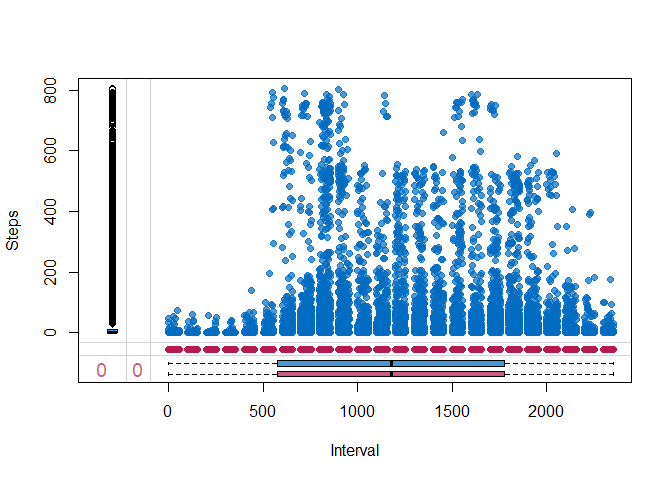

## Code for Loading and Preprocessing the Data


```r
setwd("~/00.Coursera/RepData_PeerAssessment1")
list.files()
```

```
##  [1] "activity.csv"                  "activity.zip"                 
##  [3] "doc"                           "instructions_fig"             
##  [5] "PA1_template.html"             "PA1_template.md"              
##  [7] "PA1_template.Rmd"              "PA1_template_files"           
##  [9] "plot1.png"                     "README.md"                    
## [11] "RepData_PeerAssessment1.Rproj"
```

```r
unzip("activity.zip")
list.files()
```

```
##  [1] "activity.csv"                  "activity.zip"                 
##  [3] "doc"                           "instructions_fig"             
##  [5] "PA1_template.html"             "PA1_template.md"              
##  [7] "PA1_template.Rmd"              "PA1_template_files"           
##  [9] "plot1.png"                     "README.md"                    
## [11] "RepData_PeerAssessment1.Rproj"
```

```r
data <- read.csv("activity.csv")
str(data)
```

```
## 'data.frame':	17568 obs. of  3 variables:
##  $ steps   : int  NA NA NA NA NA NA NA NA NA NA ...
##  $ date    : Factor w/ 61 levels "2012-10-01","2012-10-02",..: 1 1 1 1 1 1 1 1 1 1 ...
##  $ interval: int  0 5 10 15 20 25 30 35 40 45 ...
```

```r
data <- read.csv("activity.csv", stringsAsFactors = F, col.names=c("Steps", "Date", "Interval"), colClasses=c("numeric", "Date", "numeric"))
```


## Total Number of Steps Taken per Day

The following histogram shows the total steps taken each day between 1st October 2012 and 30th November 2012.


```r
library(dplyr)
```

```
## 
## Attaching package: 'dplyr'
```

```
## The following objects are masked from 'package:stats':
## 
##     filter, lag
```

```
## The following objects are masked from 'package:base':
## 
##     intersect, setdiff, setequal, union
```

```r
by_date <- group_by(data, Date)
step_sum <- summarize(by_date, Total = sum(Steps))
step_sum <- mutate(step_sum, Day=c(1:61))
barplot(step_sum$Total, names.arg=step_sum$Day, col="blue", main="Total Steps Taken Each Day", ylab="Number of Steps", ylim=c(0,25000), xlab="Day (1st October 2012 - 30th November 2012)", axis.lty=1, cex=0.75, cex.names=0.8, las=2, mgp=c(3,1,0))
```

<!-- -->

### Mean and Median Total Steps per Day

The following tables present the mean and median number of steps taken per day.


```r
by_date <- group_by(data, Date)
step_mean <- as.data.frame(summarize(by_date, "Mean Steps"=mean(Steps, na.rm=T)))
step_mean
```

```
##          Date Mean Steps
## 1  2012-10-01        NaN
## 2  2012-10-02  0.4375000
## 3  2012-10-03 39.4166667
## 4  2012-10-04 42.0694444
## 5  2012-10-05 46.1597222
## 6  2012-10-06 53.5416667
## 7  2012-10-07 38.2465278
## 8  2012-10-08        NaN
## 9  2012-10-09 44.4826389
## 10 2012-10-10 34.3750000
## 11 2012-10-11 35.7777778
## 12 2012-10-12 60.3541667
## 13 2012-10-13 43.1458333
## 14 2012-10-14 52.4236111
## 15 2012-10-15 35.2048611
## 16 2012-10-16 52.3750000
## 17 2012-10-17 46.7083333
## 18 2012-10-18 34.9166667
## 19 2012-10-19 41.0729167
## 20 2012-10-20 36.0937500
## 21 2012-10-21 30.6284722
## 22 2012-10-22 46.7361111
## 23 2012-10-23 30.9652778
## 24 2012-10-24 29.0104167
## 25 2012-10-25  8.6527778
## 26 2012-10-26 23.5347222
## 27 2012-10-27 35.1354167
## 28 2012-10-28 39.7847222
## 29 2012-10-29 17.4236111
## 30 2012-10-30 34.0937500
## 31 2012-10-31 53.5208333
## 32 2012-11-01        NaN
## 33 2012-11-02 36.8055556
## 34 2012-11-03 36.7048611
## 35 2012-11-04        NaN
## 36 2012-11-05 36.2465278
## 37 2012-11-06 28.9375000
## 38 2012-11-07 44.7326389
## 39 2012-11-08 11.1770833
## 40 2012-11-09        NaN
## 41 2012-11-10        NaN
## 42 2012-11-11 43.7777778
## 43 2012-11-12 37.3784722
## 44 2012-11-13 25.4722222
## 45 2012-11-14        NaN
## 46 2012-11-15  0.1423611
## 47 2012-11-16 18.8923611
## 48 2012-11-17 49.7881944
## 49 2012-11-18 52.4652778
## 50 2012-11-19 30.6979167
## 51 2012-11-20 15.5277778
## 52 2012-11-21 44.3993056
## 53 2012-11-22 70.9270833
## 54 2012-11-23 73.5902778
## 55 2012-11-24 50.2708333
## 56 2012-11-25 41.0902778
## 57 2012-11-26 38.7569444
## 58 2012-11-27 47.3819444
## 59 2012-11-28 35.3576389
## 60 2012-11-29 24.4687500
## 61 2012-11-30        NaN
```


```r
by_date <- group_by(data, Date)
step_median <- as.data.frame(summarize(by_date, "Median Steps"=median(Steps, na.rm=T)))
step_median
```

```
##          Date Median Steps
## 1  2012-10-01           NA
## 2  2012-10-02            0
## 3  2012-10-03            0
## 4  2012-10-04            0
## 5  2012-10-05            0
## 6  2012-10-06            0
## 7  2012-10-07            0
## 8  2012-10-08           NA
## 9  2012-10-09            0
## 10 2012-10-10            0
## 11 2012-10-11            0
## 12 2012-10-12            0
## 13 2012-10-13            0
## 14 2012-10-14            0
## 15 2012-10-15            0
## 16 2012-10-16            0
## 17 2012-10-17            0
## 18 2012-10-18            0
## 19 2012-10-19            0
## 20 2012-10-20            0
## 21 2012-10-21            0
## 22 2012-10-22            0
## 23 2012-10-23            0
## 24 2012-10-24            0
## 25 2012-10-25            0
## 26 2012-10-26            0
## 27 2012-10-27            0
## 28 2012-10-28            0
## 29 2012-10-29            0
## 30 2012-10-30            0
## 31 2012-10-31            0
## 32 2012-11-01           NA
## 33 2012-11-02            0
## 34 2012-11-03            0
## 35 2012-11-04           NA
## 36 2012-11-05            0
## 37 2012-11-06            0
## 38 2012-11-07            0
## 39 2012-11-08            0
## 40 2012-11-09           NA
## 41 2012-11-10           NA
## 42 2012-11-11            0
## 43 2012-11-12            0
## 44 2012-11-13            0
## 45 2012-11-14           NA
## 46 2012-11-15            0
## 47 2012-11-16            0
## 48 2012-11-17            0
## 49 2012-11-18            0
## 50 2012-11-19            0
## 51 2012-11-20            0
## 52 2012-11-21            0
## 53 2012-11-22            0
## 54 2012-11-23            0
## 55 2012-11-24            0
## 56 2012-11-25            0
## 57 2012-11-26            0
## 58 2012-11-27            0
## 59 2012-11-28            0
## 60 2012-11-29            0
## 61 2012-11-30           NA
```


## Average Daily Activity Pattern?

The following plot shows the average number of steps taken during each 5-minute interval period, averaged across all days.


```r
by_interval <- group_by(data, Interval)
intv_mean <- summarize(by_interval, "Mean_Steps" = mean(Steps, na.rm=T))
plot(intv_mean$Interval, intv_mean$Mean_Steps, type="l", main="Average Steps Taken During Each 5-Minute Interval", ylab="Average Number of Steps", ylim=c(0,250), xlab="Interval", xlim=c(0, 2500))
```

<!-- -->


The 5-minute interval averaged across all the days in the dataset, with the maximum number of steps is as follows:


```r
head(arrange(intv_mean, desc(Mean_Steps))[1,1])
```

```
## # A tibble: 1 x 1
##   Interval
##      <dbl>
## 1      835
```


## Imputing Missing Values

The total number of missing values in the dataset and in each column are as follows:


```r
table(is.na(data))
```

```
## 
## FALSE  TRUE 
## 50400  2304
```

```r
table(is.na(data$Steps))
```

```
## 
## FALSE  TRUE 
## 15264  2304
```

```r
table(is.na(data$Date))
```

```
## 
## FALSE 
## 17568
```

```r
table(is.na(data$Interval))
```

```
## 
## FALSE 
## 17568
```

The missing data pattern was further analyzed as suggested by Sagar (1). The following graphic confirmed that there are no missing data in the "Date" and "Interval" columns, but identified the 2304 missing values in the "Steps" column.


```r
library(mice)
```

```
## Warning: package 'mice' was built under R version 3.6.3
```

```
## 
## Attaching package: 'mice'
```

```
## The following objects are masked from 'package:base':
## 
##     cbind, rbind
```

```r
library(VIM)
```

```
## Warning: package 'VIM' was built under R version 3.6.3
```

```
## Loading required package: colorspace
```

```
## Loading required package: grid
```

```
## Loading required package: data.table
```

```
## Warning: package 'data.table' was built under R version 3.6.3
```

```
## 
## Attaching package: 'data.table'
```

```
## The following objects are masked from 'package:dplyr':
## 
##     between, first, last
```

```
## VIM is ready to use. 
##  Since version 4.0.0 the GUI is in its own package VIMGUI.
## 
##           Please use the package to use the new (and old) GUI.
```

```
## Suggestions and bug-reports can be submitted at: https://github.com/alexkowa/VIM/issues
```

```
## 
## Attaching package: 'VIM'
```

```
## The following object is masked from 'package:datasets':
## 
##     sleep
```

```r
library(lattice)
md.pattern(data)
```

<!-- -->

```
##       Date Interval Steps     
## 15264    1        1     1    0
## 2304     1        1     0    1
##          0        0  2304 2304
```

Plotting the missing data revealed that this represents 13% of the "Steps" data.


```r
data_miss <- aggr(data, col=mdc(1:2), numbers=TRUE, sortVars=TRUE, labels=names(data), cex.axis=.7, gap=3, ylab=c("Proportion of missingness","Missingness Pattern"))
```

<!-- -->

```
## 
##  Variables sorted by number of missings: 
##  Variable     Count
##     Steps 0.1311475
##      Date 0.0000000
##  Interval 0.0000000
```

Margin plots revealed that there is no significant difference in "Date" or "Interval" values whether or not there are missing values in the "Steps" variable (2).


```r
marginplot(data[, c("Date", "Steps")], col = mdc(1:2), cex.numbers = 1.2, pch = 19)
```

<!-- -->

```r
marginplot(data[, c("Interval", "Steps")], col = mdc(1:2), cex.numbers = 1.2, pch = 19)
```

<!-- -->

Missing data was therefore replaced by predictive mean matching, creating 5 imputed datasets, each created after maximum 20 iterations, as shown below. This second dataset was used for the subsequent analyses.


```r
mice_imputes <- mice(data, m=5, maxit = 20)
```

```
## 
##  iter imp variable
##   1   1  Steps
##   1   2  Steps
##   1   3  Steps
##   1   4  Steps
##   1   5  Steps
##   2   1  Steps
##   2   2  Steps
##   2   3  Steps
##   2   4  Steps
##   2   5  Steps
##   3   1  Steps
##   3   2  Steps
##   3   3  Steps
##   3   4  Steps
##   3   5  Steps
##   4   1  Steps
##   4   2  Steps
##   4   3  Steps
##   4   4  Steps
##   4   5  Steps
##   5   1  Steps
##   5   2  Steps
##   5   3  Steps
##   5   4  Steps
##   5   5  Steps
##   6   1  Steps
##   6   2  Steps
##   6   3  Steps
##   6   4  Steps
##   6   5  Steps
##   7   1  Steps
##   7   2  Steps
##   7   3  Steps
##   7   4  Steps
##   7   5  Steps
##   8   1  Steps
##   8   2  Steps
##   8   3  Steps
##   8   4  Steps
##   8   5  Steps
##   9   1  Steps
##   9   2  Steps
##   9   3  Steps
##   9   4  Steps
##   9   5  Steps
##   10   1  Steps
##   10   2  Steps
##   10   3  Steps
##   10   4  Steps
##   10   5  Steps
##   11   1  Steps
##   11   2  Steps
##   11   3  Steps
##   11   4  Steps
##   11   5  Steps
##   12   1  Steps
##   12   2  Steps
##   12   3  Steps
##   12   4  Steps
##   12   5  Steps
##   13   1  Steps
##   13   2  Steps
##   13   3  Steps
##   13   4  Steps
##   13   5  Steps
##   14   1  Steps
##   14   2  Steps
##   14   3  Steps
##   14   4  Steps
##   14   5  Steps
##   15   1  Steps
##   15   2  Steps
##   15   3  Steps
##   15   4  Steps
##   15   5  Steps
##   16   1  Steps
##   16   2  Steps
##   16   3  Steps
##   16   4  Steps
##   16   5  Steps
##   17   1  Steps
##   17   2  Steps
##   17   3  Steps
##   17   4  Steps
##   17   5  Steps
##   18   1  Steps
##   18   2  Steps
##   18   3  Steps
##   18   4  Steps
##   18   5  Steps
##   19   1  Steps
##   19   2  Steps
##   19   3  Steps
##   19   4  Steps
##   19   5  Steps
##   20   1  Steps
##   20   2  Steps
##   20   3  Steps
##   20   4  Steps
##   20   5  Steps
```

```r
mice_imputes$method
```

```
##    Steps     Date Interval 
##    "pmm"       ""       ""
```

```r
imputed_data <- complete(mice_imputes,2)
```

The xyplot was difficult to assess due to the large number of points. However, the density plot confirmed goodness of fit.


```r
xyplot(mice_imputes, Interval ~ Steps | .imp, pch = 20, cex = 0.5, main="XY Plot")
```

<!-- -->

```r
densityplot(mice_imputes, main="Density Plot")
```

<!-- -->

The following histogram shows the total steps taken each day between 1st October 2012 and 30th November 2012, using the imputed dataset. This demonstrates that the missing data had been filled in.


```r
by_date_imp <- group_by(imputed_data, Date)
step_sum_imp <- summarize(by_date_imp, Total = sum(Steps))
step_sum_imp <- mutate(step_sum_imp, Day=c(1:61))
barplot(step_sum_imp$Total, names.arg=step_sum$Day, col="blue", main="Total Steps Taken Each Day (Imputed Dataset)", ylab="Number of Steps", ylim=c(0,25000), xlab="Day (1st October 2012 - 30th November 2012)", axis.lty=1, cex=0.75, cex.names=0.8, las=2, mgp=c(3,1,0))
```

<!-- -->

### Mean and Median Total Steps per Day (Imputed Dataset)

The following tables present the mean and median number of steps taken per day, using the imputed dataset. These tables also demonstrates that the missing data had been filled in.


```r
by_date_imp <- group_by(imputed_data, Date)
step_mean_imp <- as.data.frame(summarize(by_date_imp, "Mean Steps"=mean(Steps, na.rm=T)))
step_mean_imp
```

```
##          Date Mean Steps
## 1  2012-10-01 31.5625000
## 2  2012-10-02  0.4375000
## 3  2012-10-03 39.4166667
## 4  2012-10-04 42.0694444
## 5  2012-10-05 46.1597222
## 6  2012-10-06 53.5416667
## 7  2012-10-07 38.2465278
## 8  2012-10-08 40.3368056
## 9  2012-10-09 44.4826389
## 10 2012-10-10 34.3750000
## 11 2012-10-11 35.7777778
## 12 2012-10-12 60.3541667
## 13 2012-10-13 43.1458333
## 14 2012-10-14 52.4236111
## 15 2012-10-15 35.2048611
## 16 2012-10-16 52.3750000
## 17 2012-10-17 46.7083333
## 18 2012-10-18 34.9166667
## 19 2012-10-19 41.0729167
## 20 2012-10-20 36.0937500
## 21 2012-10-21 30.6284722
## 22 2012-10-22 46.7361111
## 23 2012-10-23 30.9652778
## 24 2012-10-24 29.0104167
## 25 2012-10-25  8.6527778
## 26 2012-10-26 23.5347222
## 27 2012-10-27 35.1354167
## 28 2012-10-28 39.7847222
## 29 2012-10-29 17.4236111
## 30 2012-10-30 34.0937500
## 31 2012-10-31 53.5208333
## 32 2012-11-01 35.1041667
## 33 2012-11-02 36.8055556
## 34 2012-11-03 36.7048611
## 35 2012-11-04 39.6666667
## 36 2012-11-05 36.2465278
## 37 2012-11-06 28.9375000
## 38 2012-11-07 44.7326389
## 39 2012-11-08 11.1770833
## 40 2012-11-09 35.9444444
## 41 2012-11-10 43.5659722
## 42 2012-11-11 43.7777778
## 43 2012-11-12 37.3784722
## 44 2012-11-13 25.4722222
## 45 2012-11-14 38.8576389
## 46 2012-11-15  0.1423611
## 47 2012-11-16 18.8923611
## 48 2012-11-17 49.7881944
## 49 2012-11-18 52.4652778
## 50 2012-11-19 30.6979167
## 51 2012-11-20 15.5277778
## 52 2012-11-21 44.3993056
## 53 2012-11-22 70.9270833
## 54 2012-11-23 73.5902778
## 55 2012-11-24 50.2708333
## 56 2012-11-25 41.0902778
## 57 2012-11-26 38.7569444
## 58 2012-11-27 47.3819444
## 59 2012-11-28 35.3576389
## 60 2012-11-29 24.4687500
## 61 2012-11-30 32.8125000
```


```r
by_date_imp <- group_by(imputed_data, Date)
step_median_imp <- as.data.frame(summarize(by_date_imp, "Median Steps"=median(Steps, na.rm=T)))
step_median_imp
```

```
##          Date Median Steps
## 1  2012-10-01            0
## 2  2012-10-02            0
## 3  2012-10-03            0
## 4  2012-10-04            0
## 5  2012-10-05            0
## 6  2012-10-06            0
## 7  2012-10-07            0
## 8  2012-10-08            0
## 9  2012-10-09            0
## 10 2012-10-10            0
## 11 2012-10-11            0
## 12 2012-10-12            0
## 13 2012-10-13            0
## 14 2012-10-14            0
## 15 2012-10-15            0
## 16 2012-10-16            0
## 17 2012-10-17            0
## 18 2012-10-18            0
## 19 2012-10-19            0
## 20 2012-10-20            0
## 21 2012-10-21            0
## 22 2012-10-22            0
## 23 2012-10-23            0
## 24 2012-10-24            0
## 25 2012-10-25            0
## 26 2012-10-26            0
## 27 2012-10-27            0
## 28 2012-10-28            0
## 29 2012-10-29            0
## 30 2012-10-30            0
## 31 2012-10-31            0
## 32 2012-11-01            0
## 33 2012-11-02            0
## 34 2012-11-03            0
## 35 2012-11-04            0
## 36 2012-11-05            0
## 37 2012-11-06            0
## 38 2012-11-07            0
## 39 2012-11-08            0
## 40 2012-11-09            0
## 41 2012-11-10            0
## 42 2012-11-11            0
## 43 2012-11-12            0
## 44 2012-11-13            0
## 45 2012-11-14            0
## 46 2012-11-15            0
## 47 2012-11-16            0
## 48 2012-11-17            0
## 49 2012-11-18            0
## 50 2012-11-19            0
## 51 2012-11-20            0
## 52 2012-11-21            0
## 53 2012-11-22            0
## 54 2012-11-23            0
## 55 2012-11-24            0
## 56 2012-11-25            0
## 57 2012-11-26            0
## 58 2012-11-27            0
## 59 2012-11-28            0
## 60 2012-11-29            0
## 61 2012-11-30            0
```


## Differences in Activity Patterns Between Weekdays and Weekends?

The following panel plot shows the average number of steps taken during each 5-minute interval period, averaged across all days, for weekdays and for weekends. It shows clear differences in activity between weekday days and weekend days.


```r
imputed_data_w <- imputed_data %>% mutate(Weekday = if_else(weekdays(imputed_data$Date) %in% c("Monday", "Tuesday", "Wednesday", "Thursday", "Friday"), "Weekday", "Weekend"))
imputed_data_wd <- filter(imputed_data_w, Weekday == "Weekday")
imputed_data_we <- filter(imputed_data_w, Weekday == "Weekend")

par(mfrow=c(2,1), mar = c(4, 4, 2.5, 1), oma=c(0.5,0.5,0.5,0.5), mgp=c(2.5,1,0))
by_interval_wd <- group_by(imputed_data_wd, Interval)
intv_mean_wd <- summarize(by_interval_wd, "Mean_Steps" = mean(Steps, na.rm=T))
plot(intv_mean_wd$Interval, intv_mean_wd$Mean_Steps, type="l", main="Weekday: Average Steps During Each 5-Minute Interval", ylab="Number of Steps", ylim=c(0,250), xlab="Interval", xlim=c(0, 2500), cex.axis=0.8)

by_interval_we <- group_by(imputed_data_we, Interval)
intv_mean_we <- summarize(by_interval_we, "Mean_Steps" = mean(Steps, na.rm=T))
plot(intv_mean_we$Interval, intv_mean_we$Mean_Steps, type="l", main="Weekend: Average Steps During Each 5-Minute Interval", ylab="Number of Steps", ylim=c(0,250), xlab="Interval", xlim=c(0, 2500), cex.axis=0.8)
```

<!-- -->


## References

1. Chaitanya Sagar. 2017. A Solution to Missing Data: Imputation Using R, KDnuggets (https://www.kdnuggets.com/2017/09/missing-data-imputation-using-r.html)

2. Zhang Z. 2015. Missing Data Exploration; Highlighting Graphical Presentation of Missing Pattern. Ann Transl Med

